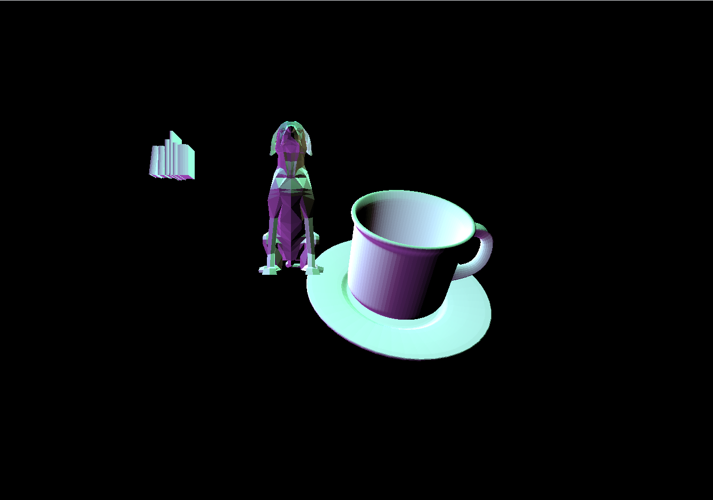

# CMPM163Labs
Class shader projects.

Lab 2
Video: https://drive.google.com/file/d/1Lbd6An2-Bnd2m4m25UKIC7Z6uEEAJjQV/view?usp=sharing

Lab 3
Video: https://drive.google.com/file/d/1Etwj0ajR0r7VQ9cIqpnAWPI7p_fyXOWA/view?usp=sharing

Cube Creation
  For the leftmost cube, I used the same method as the rightmost one, but changed the colors to create a more stark contrast between the colors. For the middle-top cube, I used a MeshFrameMaterial and set the wireframe to true, making the cube see-through. And the middle-bottom and rightmost cube were created following the lab instructions.

Lab 4
24-a) x = floor(8 x u)
24-b) y = floor(8 x (1-v))
24-c) White

Process: To make the bottom three cubes, I followed the lab instructions for the left and middle cube. For the right cube, I did the same steps as the other other cubes but with a new material.
For the top two cubes, I made the left one following the labs instructions. Then for the right cube, to get the patterned face, I divided the second paramater of the the texture 2D function, vUv, by 0.5 then modded by 0.7. 

Video: https://drive.google.com/file/d/19BdMStXjfi41PSs-VIVPOVxfCySpqyai/view?usp=sharing

Lab 5

Video: https://drive.google.com/file/d/1R3gVutlondSyk-4dKXQyovtMUj7EG_sb/view?usp=sharing

Changes: The are two modifications to the game.
1) The ring checkpoints of the game have a material that was made using Unity's shader graph. The material is blue with a green, pulsing Fresnel effect.
2) When the player reaches the last checkpoint, two particle affects with rainbow colors play by the finish line to congratulate the player.
