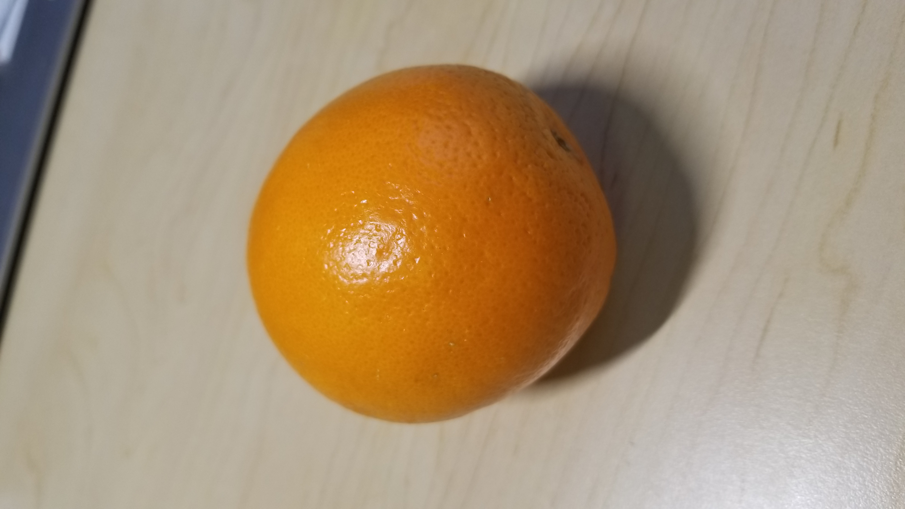
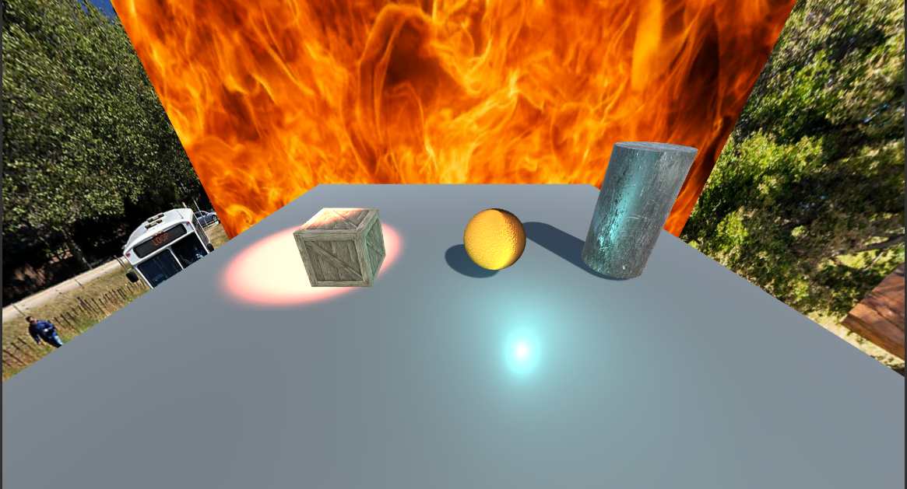
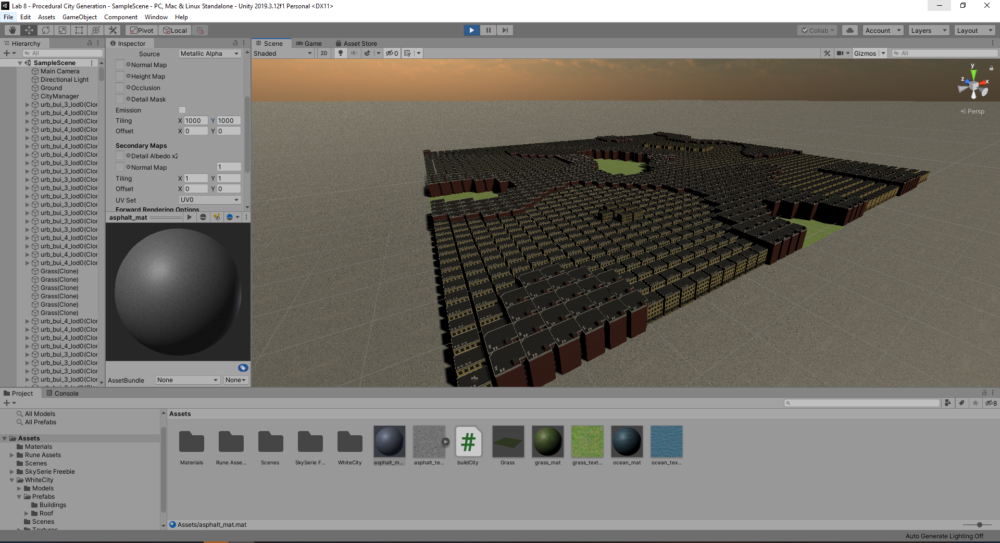
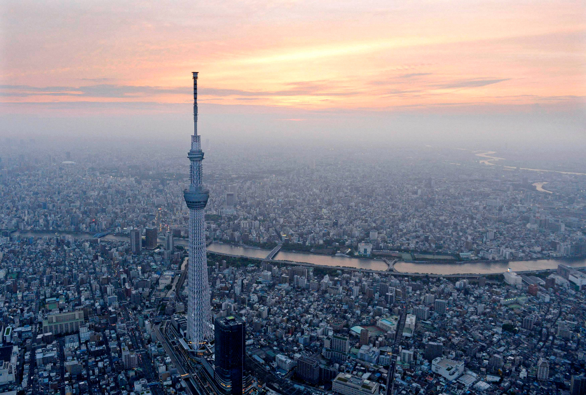

# CMPM163Labs
Class shader projects.

Lab 2
Video: https://drive.google.com/file/d/1Lbd6An2-Bnd2m4m25UKIC7Z6uEEAJjQV/view?usp=sharing

Lab 3
Video: https://drive.google.com/file/d/1Etwj0ajR0r7VQ9cIqpnAWPI7p_fyXOWA/view?usp=sharing

Cube Creation
  For the leftmost cube, I used the same method as the rightmost one, but changed the colors to create a more stark contrast between the colors. For the middle-top cube, I used a MeshFrameMaterial and set the wireframe to true, making the cube see-through. And the middle-bottom and rightmost cube were created following the lab instructions.

Lab 4
24-a) x = floor(8 x u)
24-b) y = floor(8 x (1-v))
24-c) White

Process: To make the bottom three cubes, I followed the lab instructions for the left and middle cube. For the right cube, I did the same steps as the other other cubes but with a new material.
For the top two cubes, I made the left one following the labs instructions. Then for the right cube, to get the patterned face, I divided the second paramater of the the texture 2D function, vUv, by 0.5 then modded by 0.7. 

Video: https://drive.google.com/file/d/19BdMStXjfi41PSs-VIVPOVxfCySpqyai/view?usp=sharing

Lab 5

Video: https://drive.google.com/file/d/1R3gVutlondSyk-4dKXQyovtMUj7EG_sb/view?usp=sharing

Changes: The are two modifications to the game.
1) The ring checkpoints of the game have a material that was made using Unity's shader graph. The material is blue with a green, pulsing Fresnel effect.
2) When the player reaches the last checkpoint, two particle affects with rainbow colors play by the finish line to congratulate the player.

Lab 6

  Lights
1) Directional Light - Applies light to all the objects in a scene similar to sunlight. The rotation of the directional light determines how the scene's objects are affected by the light.
2) Point Light - Works similar to a light bulb. It emits light from a point in space and what is affected is determined by the position,  range and intensity. But regardless of its rotation all objects in its radius will be affected by its light.
3) Spot Light - Works similar to a flash light/headlamp. It emits light in a cone and its angle can be adjusted to affect how wide its cone shines. It is also affected by rotation and position.
4) Area Light - Only work when baking a light map and shine in all directions on one side of a rectangular plane.

  Material
I replicated the material of an orange. I started by changing the Albedo to a color similar to the orange that I have in my room.
But the material was too flat, so I added an orange texture and applied that to the albedo and normal properties. Refining the material is still in progress because its shadows look unusual.

  Textures
I found two textures online. The first was for a crate and I applied that to a cube. The second was a metal texture that appears worn and scratched up. I applied this to a cylinder and experimented with making the texture into a normal map and applied those both to the same material. This produced a more realistic look to the single cylinder, compared to the cube that only has the texture. There is a clear difference between their surfaces in how they react to the light in the scene.

  Skybox
After reading about the six-sided skybox material, I decided to make a skybox material with a variety of images to see how they come together. This made the scene appear as though it is in side a box with a different image on each wall. 

Lab 7

Video: https://drive.google.com/file/d/1GKVCULTCONXJmLsDC8uV894RHljE8MUw/view?usp=sharing

Parter Responses:
1. I did Part2
2. I found step 19. of Part2 a little hard to understand
3. I found Part2c most interesting.

Lab 8
Part 2

Part 3

To get closer to the inspiration image, I first added a sunset skybox and fog to the scene. The hardest part was getting the taller buildings to generate with the rest. Initially, many would generate right next to each other and overlap. To overcome this, I had a variable that tracked when the last building of a specific type last spawned. It would spawn once, and then wait until the x-th number to spawn another one. But it would place a box of grass where a building would have gone to cover up the empty space.

My partner did the three.js portion of the lab. They made positioned a sphere to look like a sun cresting over their city. It looked very majestic. But there was nothing new learned.
We did not help each other for the lab as we did different parts of the assignment.
